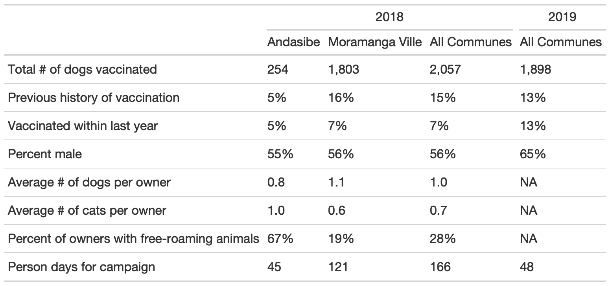

```{r setup, include=FALSE}
knitr::opts_chunk$set(echo = TRUE)
library(tidyverse)
```

## Abstract

## Introduction

Rabies

Dog vax

Rabies Mada & rabies & vets Dog Vax & cov & challenges [central point campaign vs. door to door style] Our study & aims. Misconceptions abt unowned dogs...

Here we compare two pilot vaccination efforts in the Moramanga District: one NGO-lead campaign with central point vaccination occuring over two weeks in 2018 in two communes (sub-district) vs. one locally-lead campaign with vaccines delivered continuously alongside routine veterinary services by a district veterinarian across the district between 2019 - 2020. The goal was to assess the feasibility, cost, and effectiveness of both campaign types.

## Methods

### Study Area
The Moramanga District is located mid-way between the central highlands and the east coast of Madagascar, at an average altitude of 936 m. It comprises 21 communes and NN fokontany (sub-commune), covering approximately 7150 km^2^ with a human population of x (2018 census prelim data). Previous work in the district has established a high burden of rabies exposures and deaths despite the availability of post-exposure prophylaxis at the district hospital. While Moramanga is relatively close to the capital city of Antananarivo (~ 3 hrs by bus), within the district, travel times between locations are highly variable, with much of the population living in more rural areas with limited access to roads and transportation [cite my other paper]. Before 2018, there were limited animal rabies vaccination services, with most vaccines available in urban communes and owners charged > 15,000 Ar (~ x USD) per vaccine administered. Livestock vaccination campaigns for anthrax as mandated by the government are conducted on an annual basis (owners are also charged, but fees vary by location and veterinarian).

### 2018 Campaign

```{r}
pts <- read_csv("data/campaign_pts_2018.csv")

# join with vacc #s and clean 

```

In 2018, we organized a pilot vaccination campaign through a collaboration with two NGOs (the Madagascar Dog Initiative and Traveling Animal Doctors), the Department of Veterinary Services, and the Ministry of Public Health in the District of Moramanga. We focused on two communes in Moramanga, Moramanga Ville (the urban center of the district) and Andasibe (a rural commune surrounding Andasibe National Park), where previously high incidence of suspected rabid exposures (Moramanga Ville) and a high burden of deaths (Andasibe) had been recorded [@rajeev2018].

Between date start - date end, we used central point vaccine distribution, vaccinating at `r table(pts$Commune)["Andasibe"]` points in Andasibe and `r table(pts$Commune)["Moramanga Ville"]` in Moramanga Ville. A week before the campaign dates, for each location we advertised the date with the chief of the fokontany (sub-commune) and provided posters advertising the free vaccine. During the campaign, we used Rabisin `.r` (10 mL vials with 1 mL per dose, Boehringer Ingelheim) to vaccinate both dogs and cats presented that were > 1 month old. We surveyed owners about how many dogs and cats they owned in total (split by > 1 yr vs. < 1 yr in order to avoid language ambiguities that might result in excluding pups and kttens), as well as if their dogs were free roaming (no restrictions on movement by the owner or 'mireny' in Malagasy), or tied ('mifatora') or fenced ('fefy'). Vaccinations were delivered at no cost to owners, but as animal vaccination is generally thought of as a paid service, we asked owners how much in Ariary they would be willing to pay to have one animal vaccinated for rabies. For each animal vaccinated, we recorded the species (cat or dog), sex, approximate age in years, and whether the animal had been previously vaccinated.  

To assess coverage, we used post-vaccination coverage surveys[@sambo2017; @gibson2015]. We marked all animals vaccinated with a colored, non-toxic, livestock crayon (ask Jochem for brand) along the top and back of the head. Between 4 - 6 PM on the same day as the campaign in each location, we did two transects in pairs (two people per team), walking for 1 hr starting in opposite directions and accompanied by a local guide to ensure that walking paths did not overlap. We recorded any marked and unmarked dogs we observed, and also recorded their roaming status (whether roaming, inside a fence, or tied), and their approximate age (greater or less than 1 yr of age).

### 2019 Campaign

For the 2019 campaign, instead of a central point campaign strategy, we distributed NN vaccinations (Rabisin `.r`, N vials) and the supplies needed to administer them (needle, syringe, vaccination card for owners) to the district veterinarian. She delivered the vaccination at no cost to owners, but was directly compensated 1,5000 Ar (~ 0.40 USD) per rabies vaccine administered. The campaign lasted from September 6, 2019 to June 19, 2020, with the district veterinarian advertising the vaccines by word of mouth for one week prior to her visiting each location [it would be good to know if she visited these places as part of her routine work or whether she went for the purposes of the dog vaccination]. For each vaccination, we collected the same information as previously (species, age, sex), as well as the approximate distance in meters travelled to receive the vaccination. Researchers communicated with the district veterinarian about progress periodically throughout the campaign, primarily through telephone calls. No other compensation or instructions were provided, and we asked the district veterinarian to administer as many (or as few vaccines) as feasible or wanted. As the vaccinations were delivered continuously, we did not do comporable post-vaccination surveys.

### Analyses

#### Coverage estimates
For the 2018 campaign, we used the transect data to estimate coverage as the proportion of dogs sighted that were marked with a binomial confidence interval for each location and at the commune level. For the 2019 campaign, we used a range of human:dog ratios (HDR) of 8 - 25, based on previous data from Madagascar [cite that tana study] and from the Moramanga District [cite leblanc thesis] to estimate the dog population from human population estimates [world pop] in each commune where the vaccinations were delivered [cite other papers that do this]. Then, coverage was estimated as the number of dogs vaccinated in total in that commune divided by the estimated dog population (the range given high and low HDRs). We used this same method for the 2018 campaign, as well, to compare coverage estimated by  the post-vaccination transects vs. the HDR range.  

#### Cost estimates
We documented the overall costs of the two vaccination efforts. For the 2018 campaign, we broke costs down into the following categories: direct vaccine costs (cost for Rabisin `.r`, syringes, needles, vaccination cards), supplies (livestock crayons, muzzles, gloves, alcohol, swabs), transportation costs (gas and associated vehicle costs for transport), food and lodging for NGO personnel and other vaccinators during the campaign, personnel costs (per diems for DSV veterinarian, livestock field officers, local guides, and NGO employees), and advertisement (posters and banners for advertising the campaign). Foreign NGO volunteers expenses for travel to Madagascar were not included in this costs. Vehicles and drivers are also not included in these costs, as the drivers' time and vehicle use were donated to the campaign by volunteers involved in the campaign. 

In 2019, costs were split into two categories, direct vaccine costs (for same items as in 2018), and personnel costs (per vaccine fee paid to the district veterinarian), and supplies (a generator and fuel for the veterinarian to maintain the vaccine on a cold chain when there were power outages).

#### Dog Demography
Using the age data we estimated stable age distributions, pup and adult survival in a maximum likelihood framework. Split dogs by these age classes (Anna & Morters). 
Eqs. 

Optim. Estimates were sensitive to initial conditions, so we estimated across a range of par vals. And then took the pars where pop was growing (as we believe the dog population is likely tracking the growing pop of the district)

#### Modeling vaccination campaign strategies
We took those estimates and put them into a vaccination model of a hypothetical commune with 1000 dogs. 

Eqs.

Vax lasts 3 yrs (based on Nobivac). And puppies were targeted for continous vax. Campaigns that reach 70% for each type. And combined vax. Revaccination of all individuals in between campaigns. But pup vacc is additive. 

#### Data and code availability

## Results

###  Summary of 2018 and 2019 campaigns
During the volunteer-led campaign, a total of 3,137 animals were vaccinated (2,057 dogs and 1,080 cats) in two communes in the Moramanga District. We vaccinated 2,057 animals in the urban commune of Moramanga Ville (1,756 dogs and 254 cats) across 14 vaccination points and 528 animals in the rural commune of Andasibe (254 dogs and 235 cats) across seven vaccination points (Figure 1). On average, we vaccinated 148.3 animals per vaccination point, with a maximum of 354 animals vaccinated at one point. Overall, 10.7% of animals (15.1% of dogs and 2 % of cats) had a history of previous vaccination (owner reported), however only 4.7% had been vaccinated in the previous year (6.7% of dogs and <1% of cats). The mean number of dogs owned per household was 1.04 and the mean number of cats per household was 0.69. 55% of owners only had dogs and 27% had only cats (Table 1). Owners reported that most dogs resided inside a fenced-in area (52%) in Moramanga Ville compared to 71% of dogs in Andasibe, who were reported to be free-roaming. However, fenced animals were frequently observed outside fences during the campaign, and thus the majority of animals could be classified as semi-confined in the more urban township of Moramanga Ville, and free-roaming in the rural setting of Andasibe. 

During the eight months of the DSV-led campaign, the DSV veterinarian vaccinated a total of 2,384 animals (1,898 dogs, 486 cats) across N communes in the Moramanga District. Overall, 72% of animals (75% of dogs and 20% of cats) had a history of previous vaccination (owner reported), however only 1.1% had been vaccinated in the previous year (0.6% of dogs and 2% of cats). 218 animals were reported as having been previously vaccinated in April 2018, likely during the volunteer-led campaign. Additionally, 23% of all animals vaccinated were spayed or neutered (27% of dogs and 8% of cats). Owners reported travelling an average of 611 meters (SD= 572.7 meters) to have their animals vaccinated (621 meters for dogs and 567 meters for cats). Owners with animals that did not have a history of previous vaccination travelled further on average than those that did (t = 7.747, df=136.1, p< 0.001) and dog owners travelled further to receive the vaccination than cat owners (t = 32.2416, df=1022.5, p= 0.013). (Table 2)

```{r}

```

### Comparing campaign coverage estimates

In Andasibe Ville, we were only able to did this in one of our campaign locations, due to the sparsely distributed households and roads throughout the area, as such coverage in thi s

### Comparing campaign cost estimates

### Modeling campaigns and coverage

For dogs, the sex ratio was male-biased (55%); while for cats it was female-biased (68% female). For dogs, the sex ratio was male-biased (65%), while for cats it was female-biased (66% female).

```{r this is a code chunk!}

```

## Discussion

Main findings para (feasible, should not charge, costs vs. coverage).

Limitations (owner reports, no solid ests of dog pop although HDR is reasonable and supported) Need to monitor incidence (Rajeev unpublished data anecdotally). Limitations of age data and methods. Limitations of cov data and methods. One limitation here is unowned dogs Better understanding of demography (using campaigns to monitor pop growth etc. costs may rise given increase in dog pops, pop control strategies may also be important for humane implementation of vaccination programs). Compare to LeBlanc + Rila studies Better understanding of transmission (i.e. Bourrhy & Chad studies). Cost not included was PEP for exposures during a campaign (mostly cat scratches). Getting vaccinators prep. Focusing on puppies could also help that, as they are easier to handle. Covid?

More community based delivery (Ahmed's paper, Pivot, accessibility, etc.) Possibly combining different campaign strategies could work per models Turnover is tricky & waning doesn't contribute too much. Thermotolerant & 3 yrs even without booster. (although most dogs are revaccinated and we do this in the model) Volunteer based/NGO based. Push for govt investment and viewing as a public good. The veterinary workforce (relieving pressures on them, challenges with private-public roles).


Conclude with main points & how to move forward in Madagascar

## Acknowledgements
A note abt Annie. Others who helped


