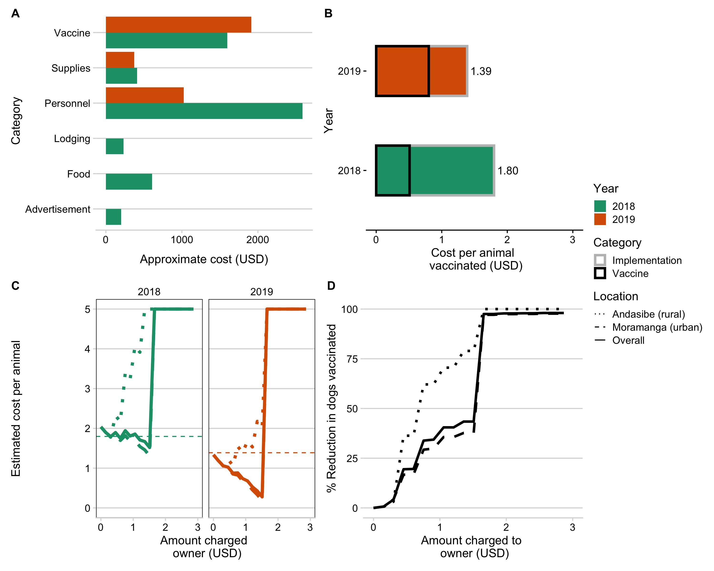
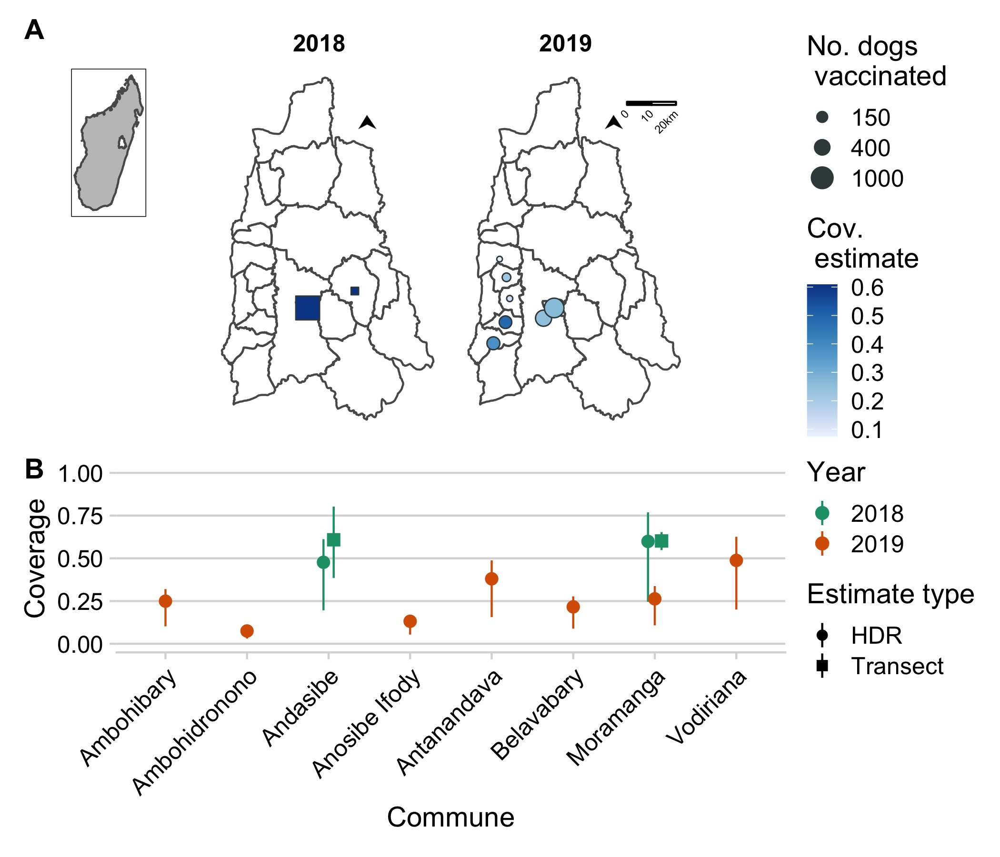

<!-- Fix citations without parentheses -->
<!-- Fix my paper should be 2019 -->
<!-- Spelling -->
<!-- Inline stats fixes -->

```{r setup, include=FALSE}
knitr::opts_chunk$set(echo = FALSE, warning = FALSE, 
                      message=FALSE, out.width="80%")
library(tidyverse)
library(glue)
library(magrittr)
library(lubridate)
library(sf)
source("R/dem_models.R")

# stats
# From Claire's MSC 
hdrs <- tribble(~loc, ~range_people_ph, ~range_dogs_ph, ~n_households,
                "urban", 4.13, 0.24, 170,
                "rural", 5.654, 0.26, 164)
# Range of hdrs then
hdrs %>% 
  mutate(mora_hdrs = range_people_ph / range_dogs_ph) -> hdrs
mora_mid_hdr <- median(hdrs$mora_hdrs)
hdr_backcalcs <- read_csv("out/hdr_backcalcs.csv")

# animals
animals_2018 <- read_csv("data/animal_2018.csv")
animals_2019 <- read_csv("data/campaign_2019.csv")

# pop ests
mora_sf <- st_read("data/shapefile/mora_communes.shp")
exch_rate <- (3128 + 3500)/2

```

## Abstract [comment: Journal reccs]

Canine rabies causes an estimated 60,000 human deaths per year, but these deaths are preventable through post-exposure prophylaxis of people and vaccination of domestic dogs. Dog vaccination campaigns acheiving coverage of 70% at the population level are effective at interrupting transmission and eventually can lead to elimination of the disease. Given this evidence, the WHO and it's partners have set a global goal to eliminate deaths due to canine rabies by the year 2030. Here, we report on initial lessons learned during pilot dog vaccination campaigns in the Moramanga District of Madagascar, a country with a high estimated burden of rabies and limited control in the dog population. We compare two different vaccination strategies: a larger volunteer driven effort to vaccinate dogs in two communes using static point vaccination, and continuous vaccination as part of routine veterinary services in the district by the District Veterinarian. We compared costs, time, personnel, and coverage acheived by each of the campaigns. We also use age data from the campaigns to estimate key demographic parameters, and use these estimates to simulate different vaccination strategies. Overall we found that dog vaccination was feasible and that most dogs were accessible to vaccination. We find that there are tradeoffs between the vaccination strategies, with the first campaign acheiving higher coverage, but with more resources and with more limited geographic scope compared to the second campaign with continuous delivery. Our modeling results suggest that targeting puppies through community based vaccination efforts could help acheive coverage levels sufficient to interrupt transmission. Moving forward, our results show that mass dog vaccination is feasible and can acheive high coverage in Madagascar, however innovative strategies and an investment in dog vaccination as a public good will be required to maintain the high and sustained levels of coverage needed for disease elimination. 


## Introduction

Canine rabies results in an estimated 60,000 human deaths per year globally [@hampson2015]. These deaths are entirely preventable: prompt post-exposure prophylaxis (PEP) of humans is highly effective at preventing death and mass dog vaccination can interrupt transmission in domestic dogs and eventually lead to disease elimination [@fooks2014]. The WHO and its partners have set a goal to eliminate human deaths due to canine rabies by the year 2030 ('ZeroBy30')[@abela-ridder2016]. Annual vaccination campaigns achieving atleast 70% coverage are the recommended target for controlling rabies in the domestic dog population [@worldhealthorganization2013]. However, achieving this coverage target in low and middle income countries where the burden of human rabies is concentrated can be challenging due to economic, ecological, sociocultural, and political reasons [@fahrion2017].

In sub-Saharan African countries, parenteral vaccination implemented through static point vaccination campaigns have been shown to be cost-effective and feasible [@borse2018]. While most dogs in these settings are considered free-roaming, they are owned and are accessible for vaccination through these campaigns [@morters2014, @jibat2015]. However, reaching and maintaining high coverage vaccination campaigns requires large scale coordinated efforts, and the challenges in implementation reflect both financial and logistical constraints more than feasibility of vaccination itself [@fahrion2017].  

In Madagascar, canine rabies has been endemic for over a century and the Institut Pasteur de Madagascar has provided PEP free-of-charge to patients in the country shortly therafter [@reynes2011]. However, currently, there are only 31 clinics where the vaccine is available, and there is limited dog vaccination due to high costs to owners and lack of availability of the vaccine [@rajeev2018a]. Recent studies have estimated a high burden of human deaths, masked by limited surveillance for canine rabies cases and human deaths across the country [@rajeev2020; @rajeev2018a]. The veterinary sector is largely private, with some veterinarians employed in hybrid private/public employment as a designated district veterinarian. While dog vaccination is rare, livestock officers and veterinarians work together to implement vaccination campaigns for anthrax on an annual basis as mandated by the government (wners are charged a fee per animal for these vaccines which vary by location) [@mondiale2017evaluation]. To date, no regular mass dog vaccinations are conducted on the island, although a few pilot programs have begun in recent years, largely implemented by NGO-government partnerships. 

Here, we summarize lessons learned through implementation of pilot vaccination programs in the Moramanga District of Madagascar, where previous work has shown high incidence of dog rabies cases and human exposures. In 2018 and 2019, we deployed two different vaccination strategies. In 2018, we led a larger scale volunteer-led pilot vaccination campaign in two Communes (sub-district level) using a central point strategy. In 2019/2020, we provided vaccines, all necessary supplies for vaccine administration, and a per-vaccine fee to the District Veterinarian (DV) to vaccinate animals as part of routine services. We compare time, human resources, costs, and coverage estimates between the campaigns. Using demographic data collected during the campaigns and a vaccination model, we also explore different vaccination strategies based on what we learned during implementation.

## Methods

### Study Area

The Moramanga District is located midway between the central highlands and the east coast of Madagascar, at an average altitude of 936 m. It comprises 21 communes, covering approximately 7150 km^2^ with an approximate human population of `r round(sum(mora_sf$pop), -2)`. Previous work in the district has established a high burden of rabies exposures and deaths despite the availability of post-exposure prophylaxis at the district hospital [@rajeev2018a]. While Moramanga is relatively close to the capital city of Antananarivo (~ 3 hrs by bus), within the district, travel times between locations are highly variable, with much of the population living in more rural areas with limited access to roads and transportation [@rajeev2020]. Before 2018, there were limited animal rabies vaccination services, with most vaccines available in urban communes and owners charged > 15,000 Ariary (~ 4.28 USD) per vaccine administered.

### 2018 Campaign

```{r}
pts <- read_csv("data/campaign_pts_2018.csv")

# join with vacc #s and clean 

```

In 2018, we organized a pilot vaccination campaign through a collaboration with two NGOs (the Madagascar Dog Initiative and Traveling Animal Doctors), the Department of Veterinary Services, and the Ministry of Public Health in the District of Moramanga. We focused on two communes in Moramanga, Moramanga Ville and Andasibe (a rural commune surrounding Andasibe National Park), where previously high incidence of suspected rabid exposures (Moramanga Ville) and a high burden of deaths (Andasibe) had been recorded [@rajeev2018]. 

A week before the campaign dates, for each location we advertised the date with the chief of the fokontany (sub-commune) and provided posters advertising the free vaccine. During the campaign, we used Rabisin `.r` (10 mL vials with 1 mL per dose, Boehringer Ingelheim) to vaccinate both dogs and cats presented that were > 1 month old. We surveyed owners about how many dogs and cats they owned in total (split by > 1 yr vs. < 1 yr in order to avoid language ambiguities that might result in excluding pups and kttens), as well as if their dogs were free roaming (no restrictions on movement by the owner/'mireny', tied/'mifatora', or fenced/'fefy'). Vaccinations were delivered at no cost to owners, but as animal vaccination is generally thought of as a paid service in Madagascar, we asked owners how much in Ariary they would be willing to pay to have one animal vaccinated for rabies. For each animal vaccinated, we recorded the species (cat or dog), sex, approximate age in years, and whether the animal had been previously vaccinated.

To assess coverage, we used post-vaccination coverage surveys according to previously established methodology[@sambo2017; @gibson2015]. We marked all animals vaccinated with a colored, non-toxic, livestock crayon [comment: ask Jochem for brand] along the top or back of the head. Between 4 - 6 PM when dogs are most active [@sambo2017] and on the same day as the campaign in each location, we did two transects in pairs (two people per team), walking for 1 hr starting in opposite directions and accompanied by a local guide to ensure that walking paths did not overlap. We recorded any marked and unmarked dogs we observed, and also recorded their roaming status (whether roaming, inside a fence, or tied), and their approximate age (greater or less than 1 yr of age).

### 2019 Campaign

For the 2019 campaign, instead of a central point campaign strategy, we distributed vaccine vials (Rabisin `.r`) and the supplies needed to administer them (needle, syringe, vaccination card for owners) to the District Veterinarian (DV). The DV delivered the vaccination at no cost to owners, but was directly compensated 1,5000 Ar (~ 0.40 USD) per rabies vaccine administered. The campaign lasted from September 6, 2019 to June 19, 2020, with the DV advertising the vaccines by word of mouth for one week prior to her visiting each location. For each animal vaccinated, the DV collected the age, sex, and also asked owners to approximate the distance they travelled to receive the vaccination in meters. Researchers communicated with the DV about progress periodically throughout the campaign, primarily through telephone calls. No other compensation or instructions were provided, and we asked the DV to administer as many (or as few vaccines) as feasible or wanted. As the vaccinations were delivered continuously, we were unable to do comparable post-vaccination surveys.

### Analyses

#### Campaign resource and cost comparisons

We documented the overall costs and resources required for the two vaccination efforts. We tracked the number of vaccination points, the number of days over which these vaccinations occurred, and the number of person days required (i.e. the number of working people per day over the campaign [@mazeri2021]), in addition to monetary costs. As costs were incurred in both USD and Ariary, and the exhange rate declined rapidly between 2018 and 2019, we used the midpoint between the two years (`r exch_rate` Ar to 1 USD) to do the cost comparisons.

For the 2018 campaign, we broke costs down into the following categories: direct vaccine costs (cost for vaccine `.r`, syringes, needles, vaccination cards), supplies (livestock crayons, muzzles, gloves, alcohol, swabs), food and lodging for NGO personnel and other vaccinators during the campaign, personnel costs (per diems for DSV veterinarian, livestock field officers, local guides, and NGO employees), and advertisement (posters and banners for advertising the campaign). Foreign NGO volunteers expenses for travel to Madagascar were not included in this costs. Vehicles and drivers are also not included in these costs, as the drivers' time and vehicle use were donated to the campaign by volunteers involved in the campaign. In 2019, costs were split into two categories, direct vaccine costs (for same items as in 2018), and personnel costs (per vaccine fee paid to the district veterinarian), and supplies (a generator and fuel for the veterinarian to maintain the vaccine on a cold chain when there were power outages). Transportation costs were also not included as the DV used her own vehicle and vaccinated alongside their routine veterinary practice. 

We used the data on owner reported willingness to pay for vaccine to estimate the proportional reduction in animals vaccinated as fees are increased. We also estimated how this would impact cost per animal vaccinated by approximating the costs for implementation (i.e. those costs that remain fixed) from costs incurred per animal vaccinated (i.e. vaccine, syringe, vaccination card, per vaccination fee to DV in 2019), and calculating the balance between the returns from owner payments (i.e. increases in cost recovery per animal vaccinated) vs. decreasing numbers of animals vaccinated overall. 

#### Coverage estimates

For the 2018 campaign, we used the transect data to estimate coverage as the proportion of dogs sighted that were marked with a binomial confidence interval at the commune level. For the 2019 campaign, we estimated vaccination coverage using human-to-dog ratios and human population estimates [@cleaveland2003, @athingo2020]. We used a range of 8 - 25, based on previous data from Madagascar [@ratsitorahina2009] and based on recent estimates from household surveys in the Moramanga District [@leblancclaireRabiesMadagascarThreepronged2019]. We set the point estimate using an HDR of `r round(mora_mid_hdr, 1)`, the midpoint between the HDRs estimated for two communities in the District by LeBlanc et al. 2019. We used human population estimates from WorldPop [@linard2012] in each commune where the vaccinations were delivered. Coverage was estimated as the number of dogs vaccinated in total in that commune divided by the estimated dog population. We used this same method for the 2018 campaign, as well, to compare coverage estimated by the post-vaccination transects vs. HDRs.

#### Dog Demography

Using the age data on vaccinated animals collected during both vaccination campaigns, we estimated the proportion of the population in four age classes: pups under the age of 1 year, juveniles 1 - 2 yrs, adults age 2 - 6 years, and older dogs age 6+ years based on . With the assumption that these estimates represent the population at a stable age distribution, we use a Leslie matrix model to estimate annual adult survival probability and fertility using maximum likelihood estimation [@Fujiwara2017]. Specifically, we assume that the number of individuals in each age class follows a Poisson distribution with the mean predicted by the stable age distribution from the model (the proportion of individuals in each age class at equilibrium, equal to the eigenvector associated with the dominant eigenvalue of the matrix $\nu$) multiplied by the total number of individuals in the population ($N_t$):

$$ N_{a} \sim Pois(\nu N_t) $$

We assume that all individuals older than 1 reproduce and do not estimate declines in fertility given the small proportion of dogs older than age six in the population. To get bootstrapped estimates, we used 100 sub-sampled data sets of 1000 observations each from the observed age data to fit the parameters, and also varied initial values used in the optimization (N = 100 initial values sets) for 10000 parameter estimates total.

#### Modeling vaccination campaign strategies

```{r}
animals_age <- read_csv("out/animals_age.csv")
original <- ages_to_class(age_yrs = animals_age$age_mos/12, 
                          years_in_class = c(1, 1, 4, 1),
                          sample = FALSE)
female <- ages_to_class(age_yrs = animals_age$age_mos[animals_age$Sex == "F"]/12, 
                          years_in_class = c(1, 1, 4, 1),
                          sample = FALSE)
```

We used the parameter estimates from the demographic model to simulate different vaccination strategies in a hypothetical commune with 1000 dogs. We used a discrete time age-structed model with a monthly time step to compare three strategies:

1)  Annual vaccination campaigns occuring within the same month each year targeting dogs of all ages
2)  Routine and continuous vaccination of new puppies targeted at the age of 3 months
3)  A combined approach with annual campaigns and routine puppy vaccination

We split the dog population into pups (< 1 yr old) and adults based on the stable age distribution estimated from the demographic model. To estimate pup survival in year one, we took the fertility estimates (number of new pups per reproducing dog in the pup age class per year) and divided by an estimate of newborn pups per reproducing dog each year based on average litter size, average number of litters per female per year [@hampson2009, @morters2014, @czupryna2016], and the proportion of the adult population that is female (estimated from our data). We assumed that for the annual campaign strategy, surviving vaccinated adult dogs were revaccinated in subsequent years [@delriovilas2017], but that if a pup had been vaccinated within 9 months of the campaign, it was not revaccinated. A subset of parameter estimates resulted in estimates of population decline, but based on the shape of the age pyramid and to simulate reasonable campaign scenarios, we filtered to parameter estimates which corresponded to positive population growth.

#### Data and ethics statement
All data were analysed in `r R.version$version.string` [@R2020], largely using the `tidyverse` package suite [@wickham2019]. Geospatial data were mapped using the sf [@sf] package. All data and code are available at [https://github.com/mrajeev08/mora_vax](https://github.com/mrajeev08/mora_vax). The vaccinations were part of a public health campaign and routine veterinary service provisioning carried out by the local veterinary officals, the NGOs involved, and in partnership with the Ministry of Public Health and the Department of Veterinary Services at the national level. The Madagascar Dog Initiative also maintains institutional approvals (IACUC # at Institution X) and national research permits (MICET permit #) for it's research and volunteer programs [comment: Kim to fill in]. 

## Results

### Summary of 2018 and 2019 campaigns
```{r}
summ_tab1 <- read_csv("out/table1_stats.csv")
species_2018 <- table(animals_2018$Species)
species_2019 <- table(tolower(animals_2019$`Dog or Cat`))
n_communes <- n_distinct(animals_2019$Commune)
animals_2019 %>% 
  filter(tolower(`Dog or Cat`) %in% "dog") %>%
  mutate(Commune = ifelse(Commune %in% "Moramanga", "Moramanga", "other"), 
         prev_vacc = ifelse(is.na(`Previous Vaccination`), "NO", 
                            `Previous Vaccination`)) %>% 
  group_by(prev_vacc, Commune) %>% 
  summarize(n = n()) %>%
  pivot_wider(values_from = n, names_from = prev_vacc) %>%
  mutate(total = NO + YES, 
         perc_vacc = round(YES / total * 100, 1)) -> prev_vacc_2019
spayed_neutered <- table(animals_2019$`Spayed/Neutered`)["YES"]/nrow(animals_2019)

dist_over_100 <- round(sum(animals_2019$`Distance Travelled (m)` <= 1000, na.rm = TRUE)/sum(!is.na(animals_2019$`Distance Travelled (m)`))*100, 0)

```

During the 2018 campaign, a total of `r nrow(animals_2018)` animals were vaccinated (`r species_2018["A"]` dogs and `r species_2018["S"]` cats) in the Moramanga (urban) and Andasibe (rural) communes over 13 days during the month of April (Table 1). We vaccinated at `r table(pts$Commune)["Andasibe"]` points in Andasibe and `r table(pts$Commune)["Moramanga Ville"]` points in Moramanga Ville. During the 2019 campaign, between `r paste(format.Date(range(dmy(animals_2019$Date)), "%B %Y"), collapse = " - ")`, the DV vaccinated a total of `r nrow(animals_2019)`animals (`r species_2019["dog"]` dogs and `r species_2019["cat"]`) over 48 days in `r n_distinct(animals_2019$Commune)` communes in the Moramanga District. While more animals were vaccinated per vaccination point and per vaccination day in 2018 compared to 2019, the number of animals vaccinated per person-day was much higher for the 2019 campaign. More animals were vaccinated in 2018 vs. 2019, but this was largely a result of vaccinating more cats during the 2018 campaign (Table 1).

In 2018, `r summ_tab1$All_2018[summ_tab1$prev_vacc]` of dogs had a previous history of vaccination (largely in the urban commune of Moramanga Ville) with only `r summ_tab1$All_2018[summ_tab1$vacc_in_year]` of dogs vaccinated within the last year. This remained largely the same in 2019 (~ `r summ_tab1$All_2019[summ_tab1$prev_vacc]`), as the DV focused their efforts in other communes. The DV did vaccinate `r prev_vacc_2019$total[prev_vacc_2019$Commune %in% "Moramanga"]` dogs in Moramanga Ville in 2019, and of those `r prev_vacc_2019$perc_vacc[prev_vacc_2019$Commune %in% "Moramanga"]`% had been vaccinated in the previous year's campaign, wheras only `r prev_vacc_2019$perc_vacc[prev_vacc_2019$Commune %in% "Moramanga"]`% of dogs vaccinated in all other communes had any history of previous vaccination. In addition, in 2019, `r round(spayed_neutered * 100, 1)`% of animals had been spayed or neutered, reflecting efforts by the Mad Dog Initiative to implemement free spay and neuter clinics in the district.

While less than `r summ_tab1$Moramanga_2018[summ_tab1$name %in% "roaming"]`% of owners in Moramanga Ville reported that their animals were free roaming, fenced animals were frequently observed outside fences during the campaign, and thus the majority of animals could be classified as semi-confined in the more urban township of Moramanga Ville, and free-roaming in the rural setting of Andasibe (approximately `r summ_tab1$Andasibe_2018[summ_tab1$name %in% "roaming"]`% of owners reported their dogs as free-roaming, Table 1). In 2019, the DV also asked owners how far they travelled approximately in meters, and `r dist_over_100`% of people travelled less than 1 km to reach the vaccination point. 

#### Table 1. Summary of 2018 and 2019 campaigns 
```{r}
knitr::include_graphics("figs/table1.png")
```

### Comparing campaign costs and willingness to pay

The 2018 campaign cost more overall and per animal vaccinated than the 2019 campaign, largely due to increased personnel costs (Fig 1A & B, Table 1). Reflecting the extra personnel necessary to run the central point campaign, the 2018 campaign also took substantially more person-days per animal vaccinated (Table 1). We found that in most contexts, charging owners for vaccination would result in minimal cost recovery (Fig 1C) and beyond a minimal cost would actually result in increased costs per vaccinated individual. More importantly, even a nominal fee would significantly reduce numbers of dogs vaccinated and thus vaccination coverage, particulary in the rural commune of Andasibe (Fig 1D).

```{r fig1} 
knitr::include_graphics("figs/fig1.jpeg")
```
#### Figure 1. Comparing campaign costs and willigness to pay 
*A) Vaccine costs broken down by category and by year (colors). B) Overall cost per animal vaccinated for the two campaign years, split by direct costs of vaccination per animal (i.e. vaccine, vaccination card, syringes) and baseline implementation costs (i.e. personnel, supplies, lodging and food during the campaign). C) Estimated cost per animal for each campaign year given increasing costs charged to the owner, with estimated costs declining due to cost recovery through owner payments and then peaking once owners are no longer willing to pay for the vaccine. D) The percent reduction in number of animals vaccinated given owners willingness to pay. The curves in C and D are shown based on the overall responses on willingness to pay (solid line) from both Moramanga and Andasibe, and the responses split by Commune (dashed and dotted lines).* 

### Comparing campaign coverage estimates
The 2018 campaign covered two communes, and was estimated to have acheived approximately 60% coverage (Figure 2A). The 2019 campaign covered `r n_distinct(animals_2019$Commune)` communes, but was estimated to have acheived lower coverage levels (Figure 2). In the 2018 campaign, we used post-vaccination coverage transects to estimate vaccination coverage, but we were unable to do this in 2019 given the continuous delivery strategy. In addition, in Andasibe in 2018, coverage estimates were based on a single transect resulting in more uncertainty. However, in both cases for 2018, coverage estimated from the transects in 2018 were consistent with the HDR based estimates (for both Andasibe and Moramanga, they fell within the range of the HDR estimates). We also back-calculated HDRs given our vaccination coverage estimates, and these were similar to the HDRs calculated from the household survey (`r hdr_backcalcs %>% filter(Commune == "Andasibe") %$% glue("{hdr_cov_est_lower} - {hdr_cov_est_upper}")` for Andasibe compared to `r `hdrs$mora_hdrs[hdrs$loc == "rural"]` in a rural community and `r hdr_backcalcs %>% filter(Commune == "Moramanga") %$% glue("{hdr_cov_est_lower} - {hdr_cov_est_upper}")` for Moramanga Ville compared to `r hdrs$mora_hdrs[hdrs$loc == "urban"]` in an urban community). 

```{r fig2}

```
#### Figure 2. Spatial estimates of coverage achieved by the 2018 and 2019 campaigns.
*A) The commune level numbers of dogs vaccinated (size of points) and the associated coverage estimates (color of points) for the year 2018 (estimated using post-vaccination transects) and 2019 (estimated using a human-to-dog ratio (HDR) of `r round(mora_mid_hdr, 1)`, based on a recent household survey in the Moramanga District). The inset shows the location of the Moramanga District in Madagascar. B) A comparison of coverage estimates by location and by method of estimation (post-vaccination surveys vs. HDR based estimates); for the transect based estimates, the line range shows the 95% exact binomial confidence interval while for the HDR based estimates, the line range shows the range of coverage estimates assuming an HDR range of 8 - 25 based on estimates from the literature.*

### Dog demography and simulating vaccination strategies
```{r}
age_data <- read_csv("out/animals_age.csv")
prop_sex <- round(table(age_data$Sex)/nrow(age_data)*100, 0)
litter_size <- c(4, 8) * 1 * 0.4 # from literature (Morters, Czupryna, etc.)
dem_ests <- read_csv("out/dem_ests.csv")
q_high <- function(x) quantile(x, 0.975)
q_low <-  function(x) quantile(x, 0.025)
mean_round <- function(x) round(mean(x), 2)
dem_ests %>%
  ungroup() %>%
  filter(pop_growth == "Growing") %>%
  select(fert_est, psurv_adult_est, growth, sim) %>%
  select(-sim) %>%
  distinct() %>%
  mutate(pup_surv_upper = fert_est/litter_size[1], 
         pup_surv_lower = fert_est/litter_size[2]) %>%
  pivot_longer(everything()) %>%
  group_by(name) %>%
  summarize(across(everything(), list(mean = mean_round, upper = q_high, lower = q_low), 
                   .names = "{.col}.{.fn}")) %>%
  rowwise() %>%
  mutate(ci = paste(round(value.lower, 2), " - ", 
                    round(value.upper, 2))) -> dem_pars

```

Demographic data from vaccinated dogs shows a population pyramid with a large base, indicative of a fast growing population, and with a male bias (approximately `r prop_sex["M"]`% male, Figure 3A). We fit these data to an age-structured model, and were able to generate parameter estimates which resulted in stable age distributions consistent with the data (Figure 3B). We filter to parameter estimates that are consistent with a growing population resulting in mean adult annual survival probability of `r dem_pars[dem_pars$name == "psurv_adult_est", "value.mean"]` (95% quantile: `r dem_pars[dem_pars$name == "psurv_adult_est", "ci"]`). We use estimates of fertility (on average `r dem_pars[dem_pars$name == "fert_est", "value.mean"]`, 95% quantile: `r dem_pars[dem_pars$name == "fert_est", "ci"]`) to back out pup survival, which ranges from `r dem_pars[dem_pars$name == "pup_surv_lower", "value.lower"]` - `r dem_pars[dem_pars$name == "pup_surv_lower", "value.upper"]`. We find that given these demographic parameters, annual campaigns that target dogs of all ages result in rapid decline in vaccination coverage in between campaigns, largely due to rapid turnover of the dog population (compared to the impact of waning of vaccine immunity, which you can see in the additional dip at year 3, Fig 3D). Continuously targeting 70% of the puppy population for vaccination, while unable to acheive the peak coverage, achieves consistent coverage of about 50% of the dog population. A combined strategy maintains the highest and most consistent levels of coverage close to the target of 70%. 

```{r fig3}

```
#### Figure 3. Dog demography and implications for campaign strategies
*A) The age pyramid for vaccinated dogs by sex. B) Bootstrapped estimates of the proportion of the population in each age class (dark blue) compared to estimates from the demographic models fit to these age data. C) Parameter estimates for annual fertility rates and adult survival probability, with estimates in orange showing the parameter estimates which result in positive population growth. B) Simulated vaccination coverage (N = 1000) using the demographic parameters from (C) in a hypothetical commune with 1000 dogs for three different campaign strategies: 1) annual vaccination campaigns targeting dogs of all ages (purple), 2) routine vaccination of puppies at 3 months of age, and 3) a combined strategy with campaigns annually and continuous puppy vaccination in between campaigns.*

## Discussion

Through the 2018 and 2019 campaigns implemented in Moramanga District, we saw high demand for vaccination from owners and found that dogs were accesible and able to be handled efficiently for parenteral vaccination. Providing the vaccine at no direct cost to owners will be critical to acheiving sufficient coverage, as even with nominal fees, a significant proportion of owners indicated they would no longer vaccinate their animals. While the 2018 vaccination campaigns acheived higher coverage over a shorter time period, it came at the a higher cost per animal vaccinated, was more limited in geographic scope, and was much more resource intensive in terms of personnel requirements. In addition, in the rural setting of Andasibe, the static point campaign strategy seemed to be less effective, reflecting less accessible human communities in this location. The 2019 campaign on the other hand where the District Veterinarian provisioned vaccines through routine services, had a much wider geographic scope and was significantly less resource intensive, but achieved lower vaccination coverage. Based on the lessons learned through the campaigns, in particular the observation that puppies were relatively easy to handle for vaccinators and owners, we used age data collected and a vaccination model to simulate different vaccination strategies, and found that continuous vaccination targeting puppies in particular may be an effective way to maintain coverage levels given high turnover in dog populations.

There were several limitations to our analyses. Owner reports of willingness to pay, age of animals, and distance travelled to the vaccination point likely all suffer from recall bias and uncertainty. In addition, age of animals brought to vaccination points may not be representative ofthe age structure of the underlying population, and other work has shown that in general puppies (individuals < 1 year) tend to have lower vaccination coverage than adults [@arief2016, @sanchez-soriano2020, @mazeri2019, @minyoo2015]. However, our analyses based on these data are consistent with previous findings from SSA that demonstrate male-biased populations, skewed towards puppies, and with high mortatlity in the first year of life [@czupryna2016, @taylor2017]. Studies have also shown that charging fees for vaccines can greatly reduce the efficacy of campaigns and acts as a significant barrier to vaccination for owners [@schildecker2016, @yoak2021, @barbosacosta2020]. Similarly, distance to campaign points has also been identified as barrier to vaccination, and in most cases owners eport traveling less than 1km to reach a vaccination point [@mazeri2018barriers, @mazeri2019]. We used human to dog ratios, which can be sensitive to underlying estimates of the dog population and the spatial scale of estimation [@sambo2018estimating, @sambo2017]. However, we were able to use estimates from a recent household survey study in the districs, and they were also consistent with coverage estimates from post-vaccination transects. Finally, in our vaccinaiton model, we  make several simplifying assumptions: we assume that immunity wanes after three years (simulating vaccination with a long-lasting vaccine such as Nobivac, compared to the one year efficacy estimated for the Rabisin vaccines that we used); we assume that vaccinated dogs that survive from year to year are revaccinated in subsequent campaigns; and in our age-structured models we do not account for population carrying capacity, but rather simulate over a short time frame over which growth estimates remain reasonable.  

Our estimates of costs per animal vaccinated are in line with recent estimates from other settings [@undurraga2020], although we likely underestimate costs given donation of time and resources by the organizations and indiviudals involved. In our estimates, we excluded costs associated with international volunteers (i.e. airfare and visa costs) as well as costs of transportation, as these were donated to the campaign. We also did not include estimates of pre-exposure prophylaxis as all of our volunteers and vaccinators had received the course prior to the campaigns. In a rabies endemic situation, it will be necessary to have both PrEP and PEP readily available for vaccinators. While the volunteer-led effort resulted in significant financial and personnel resources being devoted to the campaign, costs were higher per animal and overall. In addition, it can be difficult for NGO and volunteer based campaigns to sustain these efforts given unpredictable funding, time commitments, and turnover in staff [@ferguson2020]. The routine vaccination strategy through the DV was less costly, with the majority of the costs directly related to vaccination. Transport to locations was not included in these estimates either, as the DV had their own vehicle and largely delivered the vaccinations as part of her routine services. 

One key aspect we do not consider is the feedback loops between vaccination and demography. Estimates of the effects of vaccination on dog demography are mixed [ @czupryna2016], but vaccination could potentially increase survival of dogs [@conan2015]. If dog population growth is driven by survival, then this could mean that increased vaccination results in increased population growth. However, if growth is driven more by demand from human communities, then vaccination could stabilize the population and reduce turnover of the population. Improving dog population management, encouraging responsible pet ownership practices, and increasing veterinary services could all complement vaccination efforts, but has not been demonstrated to result in meaningful rabies control [@taylor2017].

In settings with high dog ownership, moving towards community-based vaccination strategies could be a highly effective way to achieve sufficient and consistent coverage, particulalry in rural areas where static point campaigns may be less effective. During our campaign, we found that puppies at approximately 3 months old were easy to handle for both vaccinators and owners. Puppy vaccination could therefore use local officials emmbedded in communities (along the lines of community health workers) to implement vaccination, particularly given recent findings on thermotolerance of rabies vaccines and locally manufactured methods for maintaing temperatures required for sustained vaccine storage (up to 3 months) 
[@lugelo2020]. Incentivizing vaccinators appropriately will be a key challenge, as currently providing no-cost rabies vaccination is not seen as part of routine duties for district veterinarians or for livestock officers, and these officials often required additional per diems. Implementing dog vaccination alongside government mandated livestock vaccination campaigns may also be a stategy to scale up vaccination efforts in a low-cost way. Expanding veterinary services across the country and releiving financial pressures on veterinarians and animal health workers could greatly improve veterinary services across Madagascar [@mondiale2017evaluation]. For volunteer based efforts, focusing on local volunteers (i.e. veterinary students) may be a more cost-effective strategy. However similar to international volunteers, volunteers require food, transport, and lodging during vaccination campaigns when not based in the communities where they study or live.

Overall, our results suggest that dog vaccination is a feasible and effective strategy for controlling canine rabies in Madagascar. It will be key to push rabies vaccination as a public good, to remove barriers for dog owners, and to incentivize veterinarians and other animal health workers to implement vaccination. Borrowing strategies from human vaccination efforts, i.e. use of community health workers, could be a way to improve vaccination coverage and reduce costs, particularly in rural communities where static point campaigns are less effective. In addition, continually refining vaccination strategies based on local contexts and using improved tools and systems, such as mobile phone based data collection, could improve efficacy and lower costs of campaigns [@mazeri2021a, @gibson2016a]. To monitor the success of these campaigns, it will be critical to develop efficient and effective methods to estimate vaccination coverage and to measure the true impact of campaigns on reducing rabies incidence through robust surveillance systems [@lushasi2020, @ferguson2020]. Given it's island context, Madagascar could be a model for rabies elimination, with limited chances for reintroduction from outside the island, and strategies that tackle the context specific challenges could be a path forward for the country to reach ZeroBy30.

## Acknowledgements
We thank all the veterinarians, livestock officers, local officials and leaders, NGO staff, and volunteers involved in each of the campaigns. We are grateful to staff and officials at the Department of Veterinary Services, the Ministry of Public Health, and the Institut Pasteur de Madagascar for their support and technical assistance. In particular, we thank Angelique Ferreira, Jean Hyacinthe Randrianarisoa, Ranaivoarimanana, Fierenantsoa Randriamahatana, Esther Noiarisaona, Cara Brook, and Christian Ranaivoson, Rila Ratovoson, and Claire LeBlanc. The campaign costs were supported by donations from Lush Cosmetics and [Kim to insert]. Parts of this work were funded by grants from the Center for Health and Wellbeing and the Department of Ecology and Evolutionary Biology at Princeton University to MR. MR was supported by an NSF Graduate Research Fellowship and a Princeton Insitute for Regional and International Studies Graduate Fellowship. KH is supported by the Wellcome Trust (207569/Z/17/Z).

We want to particularly acknowledge the contributions to this work by Annie Yang, an undergraduate researcher and volunteer with Princeton University and the Madagascar Dog Initiative who tragically passed away in a car accident before this research was published.

