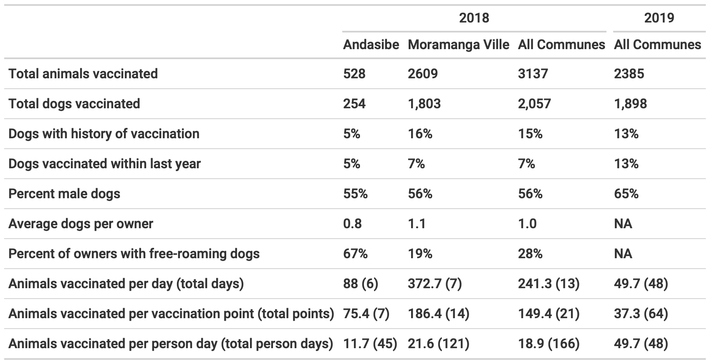

```{r setup, include=FALSE}
knitr::opts_chunk$set(echo = TRUE)
library(tidyverse)
```

## Abstract

## Introduction

*CITE*

Canine rabies results in an estimated 60,000 human deaths per year globally. These deaths are entirely preventable: prompt post-exposure prophylaxis (PEP) of humans is highly effective at preventing death and mass dog vaccination can interrupt transmission in domestic dogs and eventually lead to disease elimination. Annual vaccination campaigns achieving atleast 70% coverage are the recommended target for controlling rabies in domestic dog populations. However, achieving this coverage target in low and middle income countries where the virus can be challenging due to economic, sociocultural, and political reasons.

*Vax challenges and limitations here. Diff between SE Asia & SSA*

In Madagascar, canine rabies has been endemic for over a century and the Institut Pasteur de Madagascar has provided PEP free-of-charge to patients in the country shortly therafter. However, currently, there are only 31 clinics where the vaccine is available, and there is limited dog vaccination due to high costs to owners and lack of availability of the vaccine and veterinary services more generally. *Estimates of dog population + Vet sector (WHO report)*. Livestock vaccination campaigns for anthrax as mandated by the government are conducted on an annual basis (owners are also charged, but fees vary by location and veterinarian).

Here, we summarize lessons learned through implementation of pilot vaccination programs in the Moramanga District of Madagascar, where previous work has shown high incidence of dog rabies cases and human exposures. In 2018 and 2019, we deployed two different vaccination strategies. In 2018, we led a larger scale volunteer and NGO led pilot vaccination campaign in two Communes (sub-district level) using a central point strategy. In 2019/2020, we provided vaccinations and a per-vaccine fee to the District Veterinarian (DV) to vaccinate animals as part of routine services. We compare monetary costs and coverage estimates between the campaigns. Using demographic data collected during the campaigns and a vaccination model, we explore different vaccination strategies based on what we learned during implementation.

## Methods

### Study Area

The Moramanga District is located midway between the central highlands and the east coast of Madagascar, at an average altitude of 936 m. It comprises 21 communes and NN fokontany (sub-commune), covering approximately 7150 km^2^ with a human population of x (2018 census prelim data). Previous work in the district has established a high burden of rabies exposures and deaths despite the availability of post-exposure prophylaxis at the district hospital. While Moramanga is relatively close to the capital city of Antananarivo (\~ 3 hrs by bus), within the district, travel times between locations are highly variable, with much of the population living in more rural areas with limited access to roads and transportation [cite my other paper]. Before 2018, there were limited animal rabies vaccination services, with most vaccines available in urban communes and owners charged \> 15,000 Ar (\~ x USD) per vaccine administered.

### 2018 Campaign

```{r}
pts <- read_csv("data/campaign_pts_2018.csv")

# join with vacc #s and clean 

```

In 2018, we organized a pilot vaccination campaign through a collaboration with two NGOs (the Madagascar Dog Initiative and Traveling Animal Doctors), the Department of Veterinary Services, and the Ministry of Public Health in the District of Moramanga. We focused on two communes in Moramanga, Moramanga Ville (the urban center of the district) and Andasibe (a rural commune surrounding Andasibe National Park), where previously high incidence of suspected rabid exposures (Moramanga Ville) and a high burden of deaths (Andasibe) had been recorded [@rajeev2018]. 

A week before the campaign dates, for each location we advertised the date with the chief of the fokontany (sub-commune) and provided posters advertising the free vaccine. During the campaign, we used Rabisin `.r` (10 mL vials with 1 mL per dose, Boehringer Ingelheim) to vaccinate both dogs and cats presented that were \> 1 month old. We surveyed owners about how many dogs and cats they owned in total (split by \> 1 yr vs. \< 1 yr in order to avoid language ambiguities that might result in excluding pups and kttens), as well as if their dogs were free roaming (no restrictions on movement by the owner or 'mireny' in Malagasy), or tied ('mifatora') or fenced ('fefy'). Vaccinations were delivered at no cost to owners, but as animal vaccination is generally thought of as a paid service in Madagascar, we asked owners how much in Ariary they would be willing to pay to have one animal vaccinated for rabies. For each animal vaccinated, we recorded the species (cat or dog), sex, approximate age in years, and whether the animal had been previously vaccinated.

To assess coverage, we used post-vaccination coverage surveys[@sambo2017; @gibson2015]. We marked all animals vaccinated with a colored, non-toxic, livestock crayon [ask Jochem for brand] along the top or back of the head. Between 4 - 6 PM on the same day as the campaign in each location, we did two transects in pairs (two people per team), walking for 1 hr starting in opposite directions and accompanied by a local guide to ensure that walking paths did not overlap. We recorded any marked and unmarked dogs we observed, and also recorded their roaming status (whether roaming, inside a fence, or tied), and their approximate age (greater or less than 1 yr of age).

### 2019 Campaign

For the 2019 campaign, instead of a central point campaign strategy, we distributed vaccinations (Rabisin `.r`, N vials) and the supplies needed to administer them (needle, syringe, vaccination card for owners) to the District Veterinarian (DV). The DV delivered the vaccination at no cost to owners, but was directly compensated 1,5000 Ar (\~ 0.40 USD) per rabies vaccine administered. The campaign lasted from September 6, 2019 to June 19, 2020, with the DV advertising the vaccines by word of mouth for one week prior to her visiting each location [it would be good to know if she visited these places as part of her routine work or whether she went for the purposes of the dog vaccination]. For each animal vaccinated, we collected the age and sex, and the DV also asked owners to approximate the distance they travelled to receive the vaccination. Researchers communicated with the DV about progress periodically throughout the campaign, primarily through telephone calls. No other compensation or instructions were provided, and we asked the DV to administer as many (or as few vaccines) as feasible or wanted. As the vaccinations were delivered continuously, we were unable to do comparable post-vaccination surveys.

### Analyses

#### Coverage estimates

For the 2018 campaign, we used the transect data to estimate coverage as the proportion of dogs sighted that were marked with a binomial confidence interval for each location and at the commune level. For the 2019 campaign, we used a range of human:dog ratios (HDR) of 8 - 25, based on previous data from Madagascar [cite that tana study] and from the Moramanga District [cite leblanc thesis] to estimate the dog population from human population estimates [world pop] in each commune where the vaccinations were delivered [cite other papers that do this]. Then, coverage was estimated as the number of dogs vaccinated in total in that commune divided by the estimated dog population (the range given high and low HDRs). We used this same method for the 2018 campaign, as well, to compare coverage estimated by the post-vaccination transects vs. the HDR range.

#### Cost estimates

We documented the overall costs of the two vaccination efforts. For the 2018 campaign, we broke costs down into the following categories: direct vaccine costs (cost for Rabisin `.r`, syringes, needles, vaccination cards), supplies (livestock crayons, muzzles, gloves, alcohol, swabs), transportation costs (gas and associated vehicle costs for transport), food and lodging for NGO personnel and other vaccinators during the campaign, personnel costs (per diems for DSV veterinarian, livestock field officers, local guides, and NGO employees), and advertisement (posters and banners for advertising the campaign). Foreign NGO volunteers expenses for travel to Madagascar were not included in this costs. Vehicles and drivers are also not included in these costs, as the drivers' time and vehicle use were donated to the campaign by volunteers involved in the campaign. 

In 2019, costs were split into two categories, direct vaccine costs (for same items as in 2018), and personnel costs (per vaccine fee paid to the district veterinarian), and supplies (a generator and fuel for the veterinarian to maintain the vaccine on a cold chain when there were power outages).

*Willingness to pay*. 

*Person days*.

*Vax per point*.

#### Dog Demography

Using the age data on vaccinated animals collected during both vaccination campaigns, we estimated the proportion of the population in four age classes: pups under the age of 1 year, juveniles 1 - 2 yrs, adults age 2 - 6 years, and older dogs age 6+ years. With the assumption that these estimates represent the population at a stable age distribution, we use a Leslie matrix model to estimate annual adult survival probability and fertility using maximum likelihood estimation [@Fujiwara2017]. Specifically, we assume that the number of individuals in each age class follows a Poisson distribution with the mean predicted by the stable age distribution by the model (the proportion of individuals in each age class at equilibrium, equal to the eigenvector associated with the dominant eigenvalue of the matrix $\nu$) multiplied by the total number of individuals in the population ($N_t$):

$$ N_{a} \sim Pois(\nu N_t) $$

We assume that all individuals older than 1 reproduce and that fertility does not substantially decline (cite). To get bootstrapped estimates, we used 100 sub-sampled data sets of 1000 observations from the observed age data to fit the parameters, and also varied initital values used in the optimization (N = 100 initial values sets) for 10000 parameter estimates total.

#### Modeling vaccination campaign strategies

```{r}
animals_age <- read_csv("out/animals_age.csv")
original <- ages_to_class(age_yrs = animals_age$age_mos/12, 
                          years_in_class = c(1, 1, 4, 1),
                          sample = FALSE)
female <- ages_to_class(age_yrs = animals_age$age_mos[animals_age$Sex == "F"]/12, 
                          years_in_class = c(1, 1, 4, 1),
                          sample = FALSE)
```

We used the parameter estimates from the demographic model to simulate different vaccination strategies in a hypothetical commune with 1000 dogs. We used a discrete time age-structed model with a monthly time step to compare three strategies:

1)  Annual vaccination campaigns occuring within the same month each year targeting dogs of all ages
2)  Routine and continuous vaccination of new puppies targeted at the age of 3 months
3)  A combined approach with annual campaigns and routine puppy vaccination

We split the dog population into pups (\< 1 yr old) and adults based on the stable age distribution estimated from the demographic model. To estimate pup survival in year one, we took the fertility estimates (number of new pups per reproducing dog in the pup age class per year) and divided by an estimate of newborn pups per reproducing dog each year based on average litter size (range of 3 - 8 based on estimates from the literature, Czupryna, Annie Yang, Morters, Hampson), average number of litters per female per year (1 on average, Czupryna, Annie Yang), and the proportion of the adult population that is female (estimated from our data). We assumed that for the annual campaign strategy, surviving vaccinated adult dogs were revaccinated in subsequent years, but that if a pup had been vaccinated within 9 months of the campaign, it was not revaccinated (cite?). A subset of parameter estimates resulted in estimates of population decline, but based on the shape of the age pyramid, the growing human population in the region, and to simulate reasonable campaign scenarios, we filtered to parameter estimates which corresponded to population growth.

#### Data analysis

## Results

### Summary of 2018 and 2019 campaigns
```{r}
species_2018 <- table(animals_2018$Species)
species_2019 <- table(tolower(animals_2019$`Dog or Cat`))

```


During the 2018 campaign, a total of `nrow(animals_2018)` animals were vaccinated (`r species_2018["A"]` dogs and `r species_2018["A"]` cats) in the Moramanga (urban) and Andasibe (rural) communes over a period of xx days (Table 1). We vaccinated at `r table(pts$Commune)["Andasibe"]` points in Andasibe and `r table(pts$Commune)["Moramanga Ville"]` in Moramanga Ville. On average, we vaccinated xx animals per vaccination point, but this varied significantly between the two communes, with a maximum of 354 animals vaccinated at one point. Overall, 10.7% of animals (15.1% of dogs and 2 % of cats) had a history of previous vaccination (owner reported), however only 4.7% had been vaccinated in the previous year (6.7% of dogs and \<1% of cats). While less than 20% of owners reported that animals were not free roaming, fenced animals were frequently observed outside fences during the campaign, and thus the majority of animals could be classified as semi-confined in the more urban township of Moramanga Ville, and free-roaming in the rural setting of Andasibe where almost 70% of owners reported their dogs as free-roaming. 

During 2019/2020, the DV vaccinated a total of 2,384 animals (1,898 dogs, 486 cats, Table 1) over a period of xx months and in N communes in the Moramanga District. Overall, 72% of animals (75% of dogs and 20% of cats) had a history of previous vaccination (owner reported), however only 1.1% had been vaccinated in the previous year (0.6% of dogs and 2% of cats). 218 animals were reported as having been previously vaccinated in April 2018, likely during the volunteer-led campaign. Additionally, 23% of all animals vaccinated were spayed or neutered (27% of dogs and 8% of cats)**. The majority of people estimated travelling less than xx meters to bring their animal to the DV. 

*Table 1 should describe dogs!! (Take out cat parts & keep dogs only, & person days!)* 

```{r}

```

### Comparing campaign coverage estimates

In Andasibe Ville, we were only able to did this in one of our campaign locations, due to the sparsely distributed households and roads throughout the area, as such coverage in this

### Comparing campaign costs and willingness to pay
Costs (different categories)
Person days + dogs vax per person day (number of vaccination points)
Willingness to pay

### Dog demography and simulating vaccination strategies

For dogs, the sex ratio was male-biased (55%); while for cats it was female-biased (68% female). For dogs, the sex ratio was male-biased (65%), while for cats it was female-biased (66% female).

```{r this is a code chunk!}

```

## Discussion

Main findings para (feasible, should not charge, costs vs. coverage).

Limitations (owner reports, no solid ests of dog pop although HDR is reasonable and supported) Need to monitor incidence (Rajeev unpublished data anecdotally). Limitations of age data and methods. Limitations of cov data and methods. One limitation here is unowned dogs Better understanding of demography (using campaigns to monitor pop growth etc. costs may rise given increase in dog pops, pop control strategies may also be important for humane implementation of vaccination programs). Estimates were not super identifiable. No carrying cap. Turnover of the dog pop. Compare to LeBlanc + Rila studies Better understanding of transmission (i.e. Bourrhy & Chad studies). Cost not included was PEP for exposures during a campaign (mostly cat scratches). Getting vaccinators prep. Focusing on puppies could also help that, as they are easier to handle. Covid?

More community based delivery (Ahmed's paper, Pivot, accessibility, etc.). Possibly combining different campaign strategies could work per models Turnover is tricky & waning doesn't contribute too much. Thermotolerant & 3 yrs even without booster. (although most dogs are revaccinated and we do this in the model). Volunteer based/NGO based. Push for govt investment and viewing as a public good. Modeling after childhood vax = routine through local offices of puppies + supplemental activities by trained vets annually to catch unvax (feral, oral). The veterinary workforce (relieving pressures on them, challenges with private-public roles).

Conclude with main points & how to move forward in Madagascar

## Acknowledgements

A note abt Annie. Others who helped
